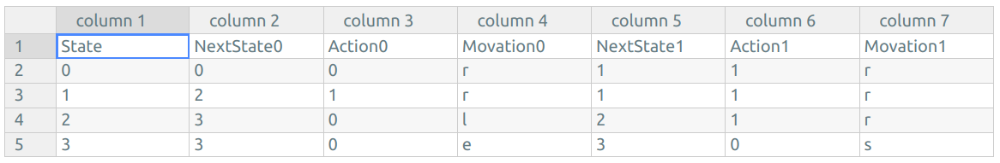

# Turing Machine Implementation In Python

<p align="center">
    </a>
</p>

# Set your table

write table in `.csv` file



- 0 State is initial state
- There are 4 move actions
    - `r` -> RIGHT
    - `l` -> LEFT
    - `s` -> STOP
    - `e` -> ERROR

# Set your tape

write tape in file (like [this](./tape.txt)) or use list are both OK

# Start yout turing machine

There is an example

```shell
python ./run.py
```

Which is an easy-adder implementation which use the digit of 1 to indicate the size of the value

You should see output below

```shell
The input tape is       [0, 1, 1, 0, 1, 1, 1, 0, 0, 0]
The output tape is      [0, 1, 1, 1, 1, 1, 0, 0, 0, 0]
```